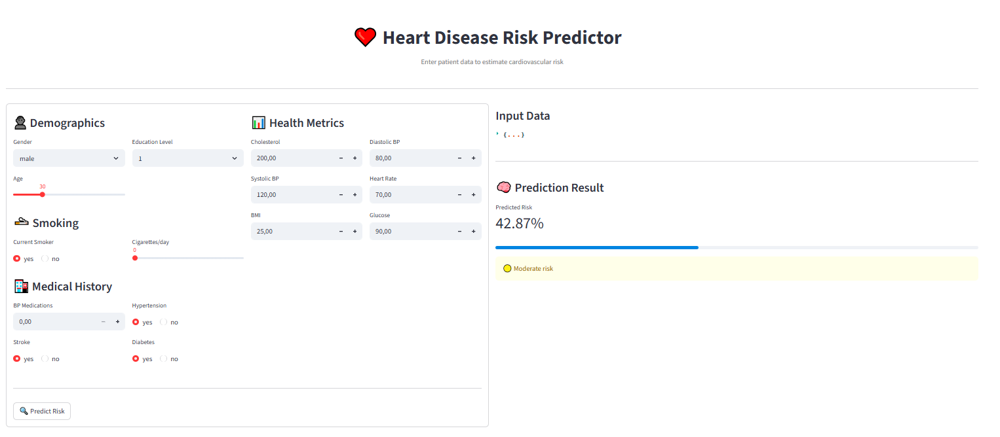
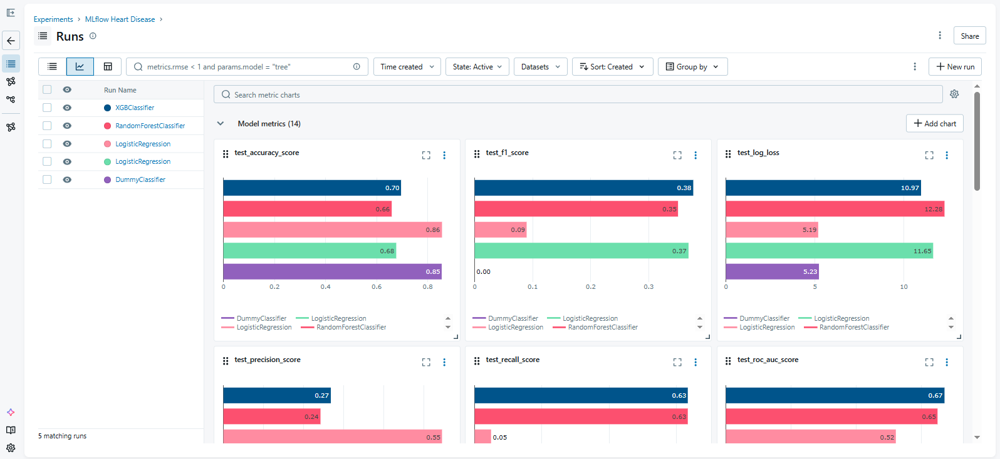
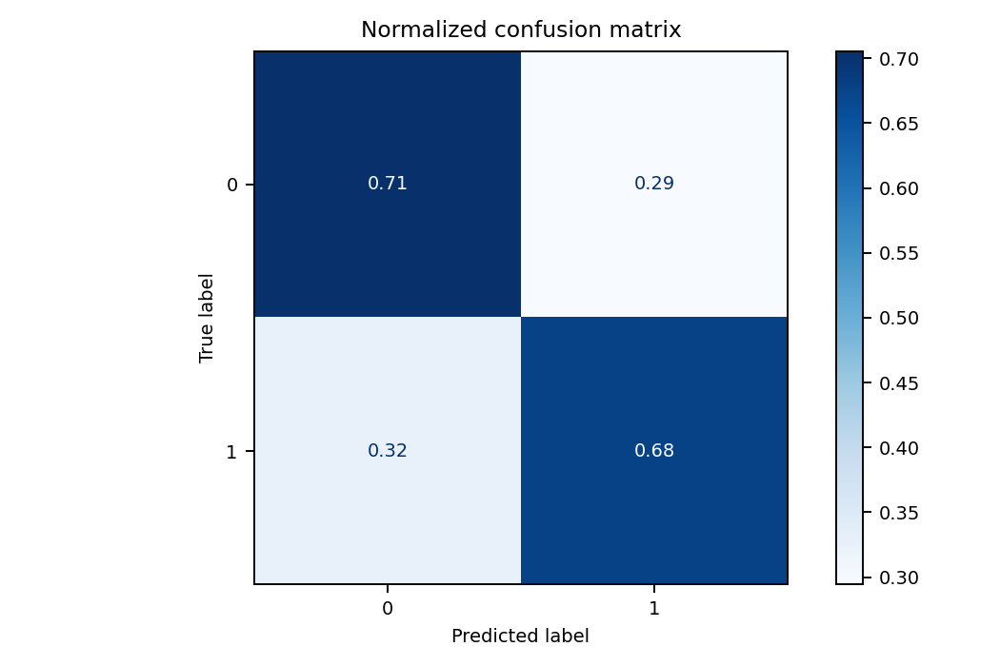
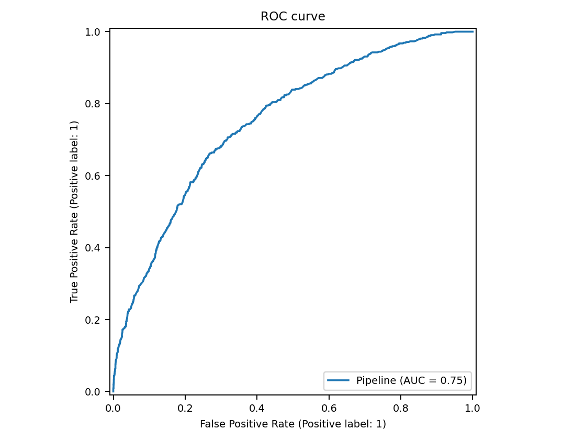
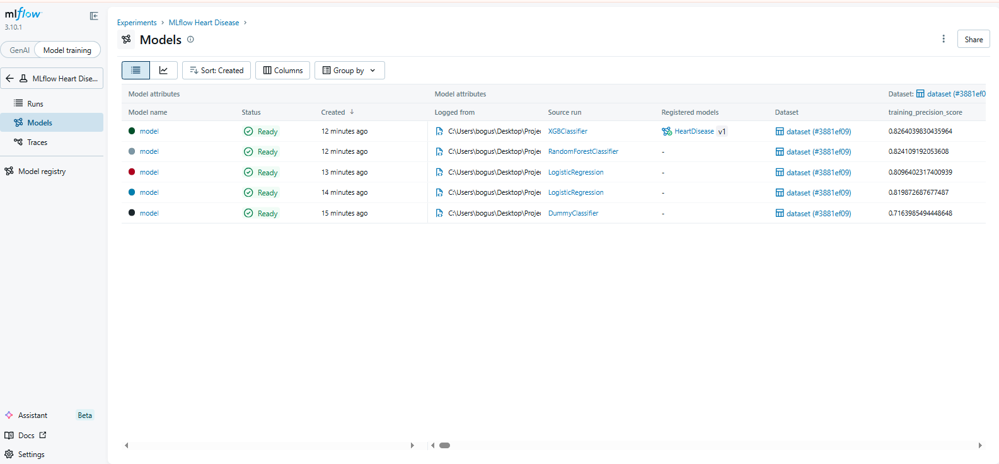

# Heart Disease Prediction Platform


---

## Overview

A **production-oriented end-to-end machine learning system** for predicting heart disease risk using clinical data. 

*Inspired by [this GeeksforGeeks article](https://www.geeksforgeeks.org/machine-learning/ml-heart-disease-prediction-using-logistic-regression/).*

This project demonstrates **real-world ML system design**, including:

- Modular ML pipeline  
- Experiment tracking & model registry (**MLflow**)  
- REST API for inference (**FastAPI**)  
- Interactive frontend (**Streamlit**)  
- Containerized deployment (**Docker Compose**)  

---

## Key Highlights

- **End-to-end ML lifecycle** (data → training → deployment)  
- **Config-driven experiments** using YAML  
- **Experiment tracking & reproducibility** with MLflow  
- **Decoupled architecture** (training / API / UI)  
- **Fully containerized system** for easy deployment  
- Clean, scalable project structure  

---

### UI Preview


---

## Model Performance

| Run ID                           | Train Accuracy | Test Accuracy | Train ROC-AUC | Test ROC-AUC | Train F1 | Test F1 |
| -------------------------------- | -------------- | ------------- | ------------- | ------------ | -------- | ------- |
| xgboost | 0.701          | 0.696         | **0.683**         | **0.670**        | **0.410**    | **0.377**   |
| random forest | 0.679          | 0.659         | **0.683**         | 0.649        | 0.397    | 0.351   |
| logistic regression unbalanced | **0.848**          | **0.856**         | 0.522         | 0.521        | 0.095    | 0.090   |
| logistic regression balanced | 0.674          | 0.677         | 0.674         | 0.666        | 0.388    | 0.369   |
| dummy | 0.846          | 0.855         | 0.500         | 0.500        | 0.000    | 0.000   |

*Best model selected based on ROC-AUC and generalization performance.*
**Xgboost**

<p align="center">
  
  
  
</p>

---

## Project Structure

```text
.
├── configs/               # Experiment configurations (YAML)
├── data/
│   ├── raw/              # Original dataset
│   └── processed/        # Cleaned & transformed data
├── notebooks/            # EDA & prototyping
├── reports/              # Metrics, plots, artifacts
├── src/                  # Training pipeline
├── serve/                # FastAPI inference service
├── ui/                   # Streamlit frontend
├── docker-compose.yml    # Multi-service orchestration
└── run.sh                # Pipeline execution
```

## ML Pipeline

### 1. Data Processing
- **Missing value handling**  
- **Feature scaling & encoding**  
- **Data validation**  

### 2. Feature Engineering
- **Domain-driven transformations**  
- **Feature selection**  

### 3. Model Training
- **Logistic Regression**  
- **Random Forest**  
- **XGBoost**  

### 4. Experiment Tracking
Using **MLflow**:  
- Parameter logging  
- Metric tracking  
- Model versioning  

### 5. Deployment
- **FastAPI** → Prediction service  
- **Streamlit** → User interface  
- **Docker** → Reproducible environment  

---

## Getting Started

### Setup
```bash
git https://github.com/michal-boguslawski/HeartDiseaseBinaryClassification.git
cd HeartDiseaseBinaryClassification
pip install -r requirements.txt
docker compose up --build
python -m src.experiment --config configs/xgboost.yaml
```

This will start:
- **API Service (FastAPI)** → [http://localhost:8000](http://localhost:8000)  
- **UI (Streamlit app)** → [http://localhost:8501](http://localhost:8501)  
- **MLflow Tracking UI** → [http://localhost:5000](http://localhost:5000)

## API Example

**POST** ```/api/v1/predict_proba```

Request Body:
```json
{
  "male": "male",
  "age": 0,
  "education": "1",
  "currentSmoker": "yes",
  "cigsPerDay": 0,
  "BPMeds": 0,
  "prevalentStroke": "yes",
  "prevalentHyp": "yes",
  "diabetes": "yes",
  "totChol": 0,
  "sysBP": 0,
  "diaBP": 0,
  "BMI": 0,
  "heartRate": 0,
  "glucose": 0
}
```

## Experiment Tracking (MLflow)
- Track runs and compare models
- Store artifacts and metrics
- Register production-ready models



## Future Improvements
- [ ] Hyperparameter tuning (Optuna)
- [ ] Cloud deployment (AWS/GCP)
- [ ] CI/CD pipeline
- [ ] Model monitoring & drift detection
- [ ] Unit & integration tests
- [ ] SHAP values
- [ ] Post-Model analysis

## License

This project is licensed under the [MIT License](LICENSE).

## Why This Project Stands Out

This project demonstrates production-grade ML engineering skills, not just modeling:
- Separation of concerns (training vs serving vs UI)
- Reproducibility via configs and MLflow
- Deployment-ready architecture
- Clean, scalable codebase
